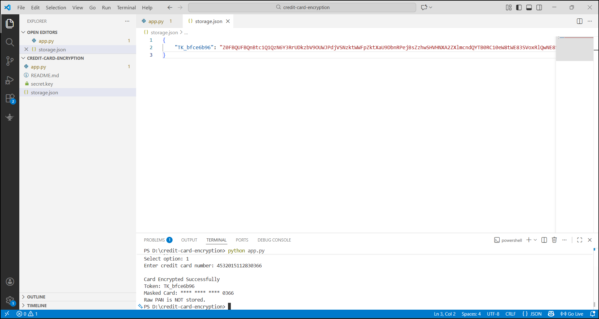

# Credit Card Encryption & Decryption Service

## Project Overview
This project is a secure system that encrypts and decrypts credit card numbers (PAN – Primary Account Number) while ensuring that raw card data is never stored in plain text. Instead of storing the actual card number, the system generates a token that can be safely stored and used later.

The system also masks sensitive data so that only the last few digits of the card number are visible, improving data security and privacy.

This project demonstrates how encryption and tokenization are used in real-world payment processing systems.

## Objectives
- Encrypt credit card PAN securely
- Decrypt PAN using a secure key
- Implement tokenization
- Mask sensitive card numbers
- Prevent storage of raw PAN data

## Technologies Used
- Python
- cryptography library

## Features
- Secure PAN encryption
- Token generation for safe storage
- Credit card masking
- Secure key-based decryption
- No storage of raw credit card numbers
- Base encoding for safe data handling

## How the System Works
1. User enters a credit card number.
2. The system encrypts the PAN using a secure encryption algorithm.
3. A token is generated and stored instead of the real card number.
4. The card number is masked for display (e.g., **** **** **** 1234).
5. When needed, the system decrypts the PAN using the secure key.

## Installation

Install required library:

pip install cryptography

## How to Run

Run the encryption service:

python app.py

Enter a credit card number when prompted.

The system will:
- Encrypt the card number
- Generate a token
- Display a masked card number

## Example Output

Original PAN: 4532015112830366  
Masked PAN: **** **** **** 0366  
Token: TK_9f83a1c2  
Encrypted Data: Stored securely

## Project Screenshot

## Project Structure

credit-card-encryption
│
├── app.py
├── storage.json
└── README.md

## Learning Outcomes
- Understanding secure encryption techniques
- Tokenization concepts
- Data masking for privacy
- Secure storage practices
- Basics of format-preserving encryption (FPE)

## Security Note
This project is for educational purposes only and demonstrates secure handling of sensitive financial data.

## Author
Pranoti Dangore